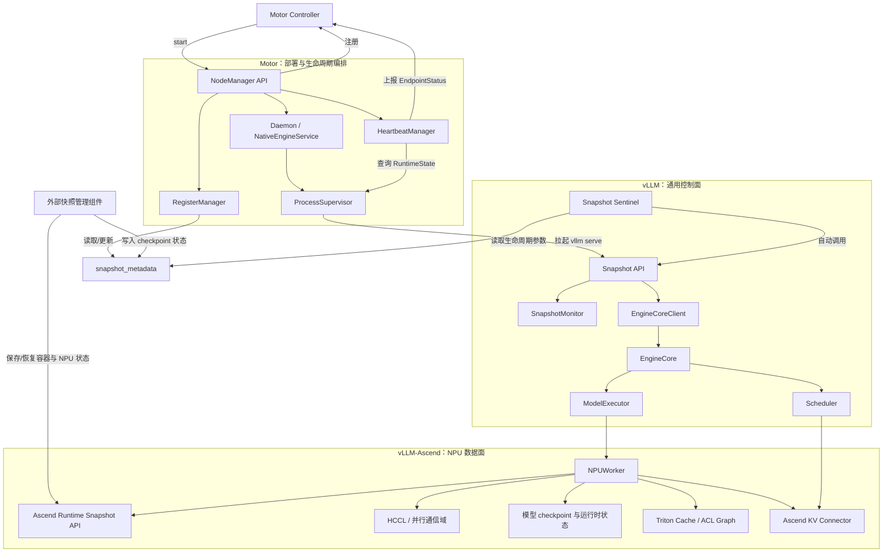
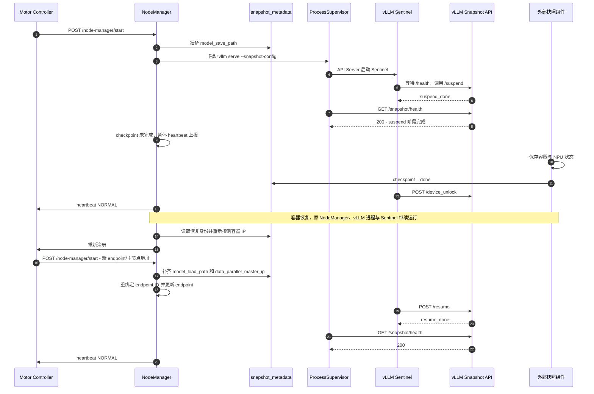
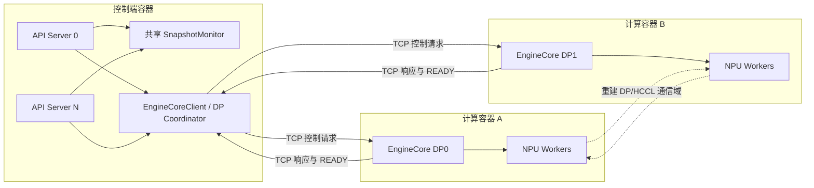
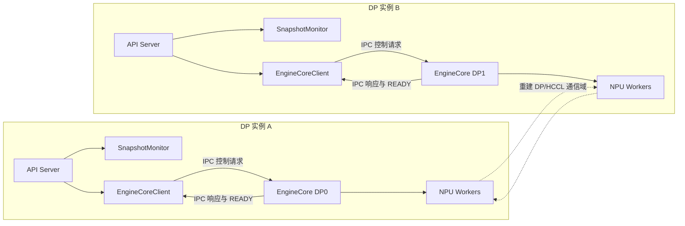
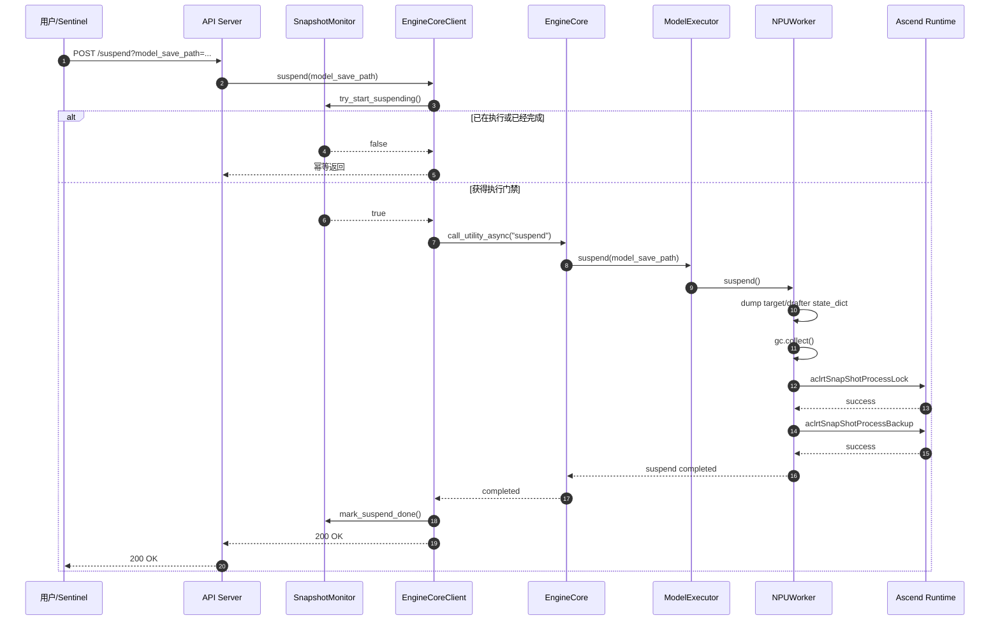
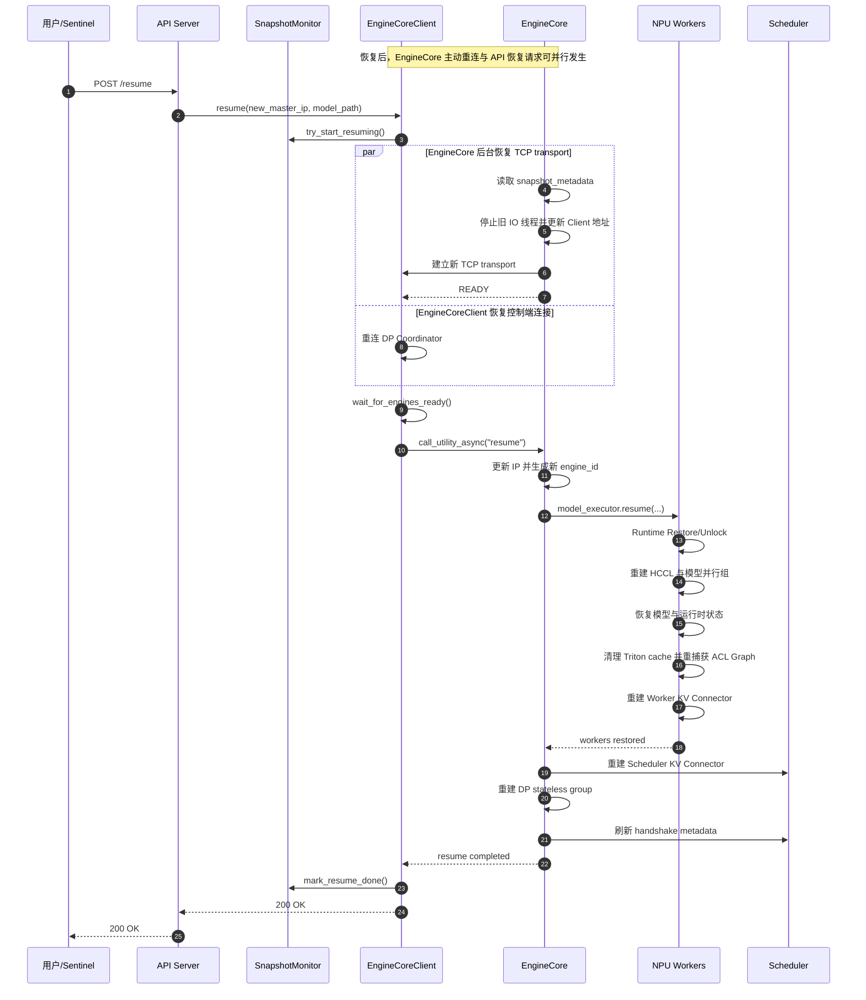
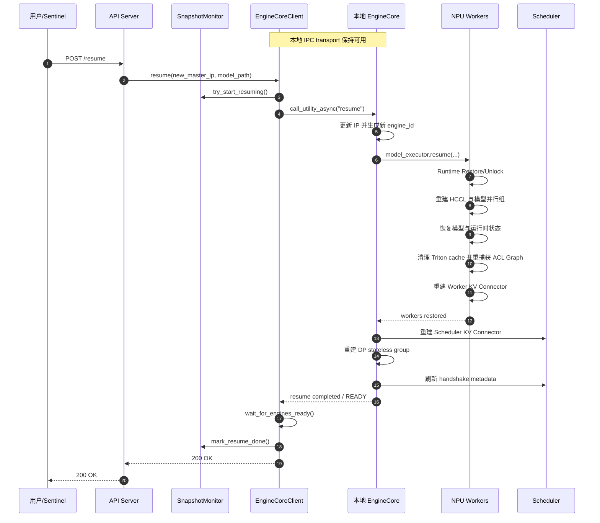

# Motor / vLLM / vLLM-Ascend 容器快照架构

## 1. 概述

当前容器快照恢复功能由 Motor、vLLM 与 vLLM-Ascend 共同实现，三个仓库的职责边界如下：

- **Motor**：负责控制面编排，包括准备和更新 `snapshot_metadata`、按配置拉起原生 `vllm serve`、探测快照生命周期状态，以及恢复后的容器身份刷新、重新注册和 endpoint 重绑定。
- **vLLM**：负责通用控制面，包括快照配置、HTTP API、生命周期状态、跨进程调用、EngineCore 传输重连、恢复流程编排和设备后端扩展接口。
- **vLLM-Ascend**：负责 NPU 数据面，包括 Ascend Runtime 快照接口、HCCL 通信域重建、模型 Tensor 恢复、运行时状态清理、ACL Graph 重捕获和 Ascend KV Connector 重建。

对应分支：

- vLLM：`snapshot_0.26.0`
- vLLM-Ascend：`snapshot_0.26.0rc1`
- Motor：当前 `upstream/master` 基线（`86639ee7`）

## 2. 整体目录结构

```text
Motor
├── motor/config/node_manager.py
├── motor/common/utils/snapshot_utils.py
└── motor/node_manager/
    ├── api_server/node_manager_api.py
    └── core/
        ├── register_manager.py
        ├── heartbeat_manager.py
        ├── daemon.py
        └── services/native_engine/
            ├── service.py
            ├── supervisor.py
            └── backends/
                ├── base.py
                └── vllm/config.py

vLLM
├── vllm/config/snapshot.py
├── vllm/snapshot/
│   ├── monitor.py
│   ├── utils.py
│   └── kv_connector_lifecycle.py
├── vllm/entrypoints/serve/snapshot/
│   ├── api_router.py
│   └── sentinel.py
├── vllm/v1/engine/
│   ├── core_client.py
│   └── core.py
├── vllm/v1/executor/abstract.py
├── vllm/v1/worker/worker_base.py
└── vllm/distributed/kv_transfer/.../base.py

vLLM-Ascend
├── vllm_ascend/snapshot/
│   ├── worker_lifecycle.py
│   ├── distributed.py
│   └── model_runtime/
│       ├── checkpoint.py
│       ├── h2d_copy.py
│       ├── tensor_lifecycle.py
│       ├── module_lifecycle.py
│       └── restore.py
├── vllm_ascend/worker/worker.py
├── vllm_ascend/compilation/acl_graph.py
├── vllm_ascend/patch/worker/patch_distributed.py
└── vllm_ascend/distributed/kv_transfer/
    ├── ascend_multi_connector.py
    ├── kv_p2p/
    └── kv_pool/
```

### 2.1 总体分层关系



## 3. vLLM：通用快照控制面

### 3.1 配置与功能 Gate

`vllm/config/snapshot.py` 定义了 `SnapshotConfig`：

```text
SnapshotConfig
├── snapshot_metadata
└── enable_auto_checkpoint
```

不同配置下的行为如下：

| 配置 | 行为 |
| --- | --- |
| 未提供 `snapshot_config` | 快照特性关闭，不挂载接口、不创建 Monitor、不预留恢复端口 |
| 提供 `snapshot_config`，但未开启自动管理 | 挂载 `/suspend`、`/resume`、`/device_unlock`，由用户手动管理生命周期 |
| `enable_auto_checkpoint=true` | 在手动接口基础上启动 Sentinel，并挂载 `/snapshot/health` |
| 自动管理开启但未提供 `snapshot_metadata` | 配置校验失败，服务启动报错 |

启用 `snapshot_config` 后还会：

- 为恢复后的通信域预留两个端口；
- 为相关 ZMQ Router 启用 `ROUTER_HANDOVER`；
- 持久化需要随模型 checkpoint 保存的通用 Tensor；
- 启用设备后端的快照恢复路径。

### 3.2 HTTP API

`vllm/entrypoints/serve/snapshot/api_router.py` 提供以下接口：

```text
POST /suspend
POST /resume
POST /device_unlock
GET  /snapshot/health
```

其中：

- `/suspend`、`/resume` 和 `/device_unlock` 在配置 `snapshot_config` 后挂载；
- `/snapshot/health` 仅在 `enable_auto_checkpoint=true` 时挂载；
- API 层不直接执行设备操作，而是调用 `EngineClient`；
- 集中式部署且存在远端 DP Engine 时，`/suspend` 和 `/resume` 强制要求配置 `snapshot_metadata`；
- 仅使用本地 IPC 的部署不依赖 metadata 完成 EngineCore 传输重连。

### 3.3 SnapshotMonitor

`vllm/snapshot/monitor.py` 管理生命周期门禁和完成状态：

```text
SnapshotMonitor
├── 执行门禁
│   ├── is_suspending
│   ├── is_unlocking
│   └── is_resuming
└── 完成状态
    ├── suspend_done
    ├── unlock_done
    └── resume_done
```

主要职责：

- 防止多个 API Server 重复执行快照操作；
- 保证状态检查与设置是原子的；
- 记录每个生命周期阶段是否成功完成；
- 为 `/snapshot/health` 提供状态；
- 操作失败时释放执行门禁，但不设置对应的 `done` 状态。

集中式部署中的多个 API Server 共享同一个多进程 Monitor。分布式 DP 的不同服务实例不会共享 Monitor。

### 3.4 Snapshot Sentinel

`vllm/entrypoints/serve/snapshot/sentinel.py` 负责自动 checkpoint 生命周期管理：

```text
冷启动进程
  → 等待 /health 就绪
  → 调用 /suspend
  → 等待外部 checkpoint 完成
  → 调用 /device_unlock

快照恢复进程
  → 检测 restore 标志
  → 读取 snapshot_metadata
  → 调用 /resume
```

集中式多 API Server 部署中，仅由 `API Server 0` 启动 Sentinel。Sentinel 发出的 HTTP 请求仍可能由任意 API Server 处理，重复执行由共享 Monitor 阻止。

### 3.5 EngineCoreClient

`vllm/v1/engine/core_client.py` 是 API 层到 EngineCore 的控制桥梁：

```text
API
  → AsyncLLM
    → EngineCoreClient
      → call_utility_async()
        → EngineCore
```

主要职责：

- 使用 SnapshotMonitor 管理生命周期门禁；
- 集中式 DP 下重连 API Client 到 DP Coordinator 的 TCP 通道；
- 等待 EngineCore 主动重连并发送 `READY`；
- 向 EngineCore 下发 `suspend`、`device_unlock` 和 `resume` 指令。

两种 DP 传输路径的恢复顺序不同：

```text
集中式 DP / TCP：
EngineCore 主动重连 → READY → EngineCoreClient 发送 resume

分布式 DP / IPC：
EngineCoreClient 发送 resume → EngineCore 恢复 → READY
```

### 3.6 EngineCore

`vllm/v1/engine/core.py` 是恢复流程的通用编排中心：

```text
EngineCore.resume()
├── 重连 EngineCore ↔ EngineCoreClient transport
├── 更新 data_parallel_master_ip
├── 强制探测恢复后的本地 IP
├── 刷新 KV transfer engine_id
├── model_executor.resume(...)
│   └── 下发到所有设备 Worker
├── 重建 Scheduler 侧 KV Connector
├── 重建 EngineCore DP stateless group
└── 刷新 Scheduler handshake metadata
```

关键顺序约束：

- Worker 和 NPU 恢复完成后，才重建 Scheduler 侧 KV Connector；
- 新 `engine_id` 在 Worker 与 Scheduler 重建前统一生成；
- Scheduler handshake metadata 在 Worker Connector 重建完成后刷新。

### 3.7 通用扩展接口

vLLM 只定义设备无关的接口：

```text
WorkerBase
├── suspend()
├── device_unlock()
└── resume()

KVConnectorBase
└── rebuild_kv_transfer_endpoint()

Platform
└── is_restore()
```

这些接口的 NPU 实现由 vLLM-Ascend 提供。

## 4. vLLM-Ascend：NPU 快照恢复实现

### 4.1 Worker 生命周期编排

`vllm_ascend/snapshot/worker_lifecycle.py` 是 Ascend Worker 快照操作的顶层入口。

Suspend 顺序：

```text
dump_model_checkpoint
→ gc.collect
→ aclrtSnapShotProcessLock
→ aclrtSnapShotProcessBackup
```

Unlock：

```text
aclrtSnapShotProcessUnlock
```

Resume 顺序：

```text
aclrtSnapShotProcessRestore
→ aclrtSnapShotProcessUnlock
→ 清理 Triton Kernel launcher cache
→ 更新 Worker 网络信息
→ 销毁并重建 HCCL/模型并行通信域
→ 恢复模型 checkpoint 和运行时状态
→ 重新捕获 ACL Graph
→ 重建 Worker 侧 KV Connector
```

`vllm_ascend/worker/worker.py` 中的 `suspend`、`device_unlock` 和 `resume` 是薄封装，具体实现集中在 snapshot 模块。

### 4.2 通信域生命周期

`vllm_ascend/snapshot/distributed.py` 负责：

- 清理 vLLM model-parallel group；
- 清理 Ascend HCCL group；
- 清理分布式环境和通信组名称注册表；
- 使用预留端口和恢复后的主节点 IP 重建通信域。

`vllm_ascend/patch/worker/patch_distributed.py` 中的 HCCL 特殊销毁逻辑只在以下上下文中启用：

```python
with snapshot_hccl_teardown(True):
    ...
```

因此不会影响普通的通信域销毁路径。

通信域重建完成后，还需要刷新长期持有旧通信域引用的对象：

- MoE config 中的 TP、DP、EP 和 MC2 group；
- MoE token dispatcher；
- All2AllV 的本地 expert 映射；
- MegaMoe 对称内存等通信相关运行时资源。

### 4.3 模型运行时恢复模块

`vllm_ascend/snapshot/model_runtime` 按职责分为五个文件。

#### 4.3.1 checkpoint.py

负责目标模型与 Drafter 模型的：

- `state_dict` 保存；
- `state_dict` 加载；
- CPU checkpoint 到已有 NPU Parameter/Buffer 的恢复。

Target 模型和 Drafter 模型使用独立的 checkpoint 文件。

#### 4.3.2 h2d_copy.py

负责恢复时的 Host-to-Device Tensor 拷贝策略：

```text
Tensor Copy Strategy
├── W4A8 V1 NZ int32 packed
│   └── 重建 FRACTAL_NZ 存储后拷贝
└── Direct Copy
    └── 普通 layout 直接 copy_
```

当前专门适配的是 msModelSlim W4A8 Dynamic V1 NZ packed 权重。其他特殊 layout 需要通过新增 Copy Strategy 扩展。

#### 4.3.3 tensor_lifecycle.py

负责 Tensor 的持久化注册和全局派生 Tensor 恢复：

- 将普通 Tensor 属性注册为 persistent buffer；
- 将 Tensor list 注册为可进入 `state_dict` 的 buffer；
- 恢复 DSA、DCP 和 SFA Hadamard Tensor；
- 重新绑定 MLA、RoPE 等模块级缓存。

#### 4.3.4 module_lifecycle.py

统一扫描模型中的 Module 和其持有的 backend implementation：

```text
nn.Module
└── module.impl
```

扫描过程中按顺序调用两个 vLLM-Ascend 私有 hook：

```python
rebuild_derived_tensors_after_snapshot_restore(...)
reset_runtime_state_after_snapshot_restore()
```

当前设计保证：

- vLLM 主仓不需要暴露 Ascend 具体恢复 hook；
- Module 不需要手工转发其 impl 的 hook；
- 共享对象通过对象 ID 去重，同一 hook 只执行一次。

#### 4.3.5 restore.py

`restore_model_runner()` 汇总模型和 ModelRunner 的恢复流程：

```text
恢复 Target state_dict
→ 重建 Target 派生 Tensor
→ 恢复 Drafter state_dict
→ 重建 Drafter 派生 Tensor
→ 恢复模块级全局 Tensor
→ 清理投机解码请求残留
→ 恢复 Drafter 可复用 buffer
→ 重置 Target/Drafter attention metadata builder
→ 重置 attention mask builder
→ 清理 ModelRunner 输入和 staging buffer
→ 调用 Module/Impl runtime reset hook
→ 清空 Host/NPU block table
```

模型恢复涉及的状态可以分为以下层级：

| 层级 | 典型状态 |
| --- | --- |
| 模型持久状态 | 权重、量化 scale、注册 buffer |
| 模型派生状态 | MLA absorbed weight、FA quant weight、RoPE cache |
| Module/Impl 运行时状态 | DCP/SFA metadata、dispatcher、通信域引用 |
| ModelRunner 请求状态 | positions、token counter、MoE staging buffer |
| 投机解码状态 | draft token、request-index 映射、Drafter buffer |
| KV 管理状态 | Host/NPU block table |
| 编译运行时状态 | Triton launcher cache、ACL Graph handle |

### 4.4 Triton Kernel Cache 与 ACL Graph

恢复后会清除已经加载过的 Triton Kernel launcher cache，避免恢复前缓存的 Kernel 调用约定或 NPU 句柄继续被复用。

`vllm_ascend/compilation/acl_graph.py` 负责图模式恢复：

```text
清理旧 ACL Graph entries
→ 清理 GraphParams 中的 event/workspace/handle
→ 重建 graph pool
→ 重新 capture_model()
```

配置 `enforce_eager=true` 时跳过 ACL Graph 重捕获。

### 4.5 KV Connector 恢复

Ascend KV Connector 的结构如下：

```text
vLLM EngineCore / Scheduler
└── KVConnectorBase
    └── AscendMultiConnector
        ├── P2P Connector
        │   ├── MooncakeConnector
        │   ├── MooncakeHybridConnector
        │   └── MooncakeLayerwiseConnector
        └── AscendStoreConnector
            ├── KVPoolScheduler
            │   └── Scheduler Backend
            └── KVPoolWorker
                └── Worker Backend
                    ├── MooncakeBackend
                    └── MemcacheBackend
```

`AscendMultiConnector.rebuild_kv_transfer_endpoint()` 分为两个阶段：

```text
第一阶段：所有子 Connector 执行 prepare
  → 统一摘除旧 store、TransferEngine 和 endpoint 引用

第二阶段：按顺序执行 rebuild
  → 先重建 P2P Connector
  → 后重建 Pool Connector
```

必须先让所有 Connector 释放旧 store 或 TransferEngine 引用，再开始创建新的网络端点。

Worker 侧恢复内容包括：

- 停止旧的发送和接收线程；
- unregister KV Cache buffer；
- 释放旧 TransferEngine 或 store；
- 使用新的本地 IP 和 `engine_id` 重建 endpoint；
- 重新注册 Worker 预分配的 KV Cache buffer。

Scheduler 侧恢复内容包括：

- 更新 `engine_id` 和 endpoint；
- 重建调度侧 backend/client；
- 刷新 Worker handshake metadata。

## 5. Motor：部署编排与状态观测

Motor 位于外部控制器与原生 vLLM 服务之间。它不实现设备恢复，也不直接调用 vLLM 的 `/suspend`、`/resume` 或 `/device_unlock`；自动 checkpoint 生命周期由 Motor 配置并拉起的 vLLM Sentinel 执行。

### 5.1 配置与功能边界

`motor/config/node_manager.py` 中的 `SnapshotConfig` 包含：

```text
SnapshotConfig
├── enable_snapshot
└── snapshot_metadata_path
```

启用快照后的配置传递链路如下：

```text
NodeManager SnapshotConfig
  → NativeEngineService LaunchContext.snapshot_metadata
  → EndpointConfig
      ├── snapshot_metadata
      └── enable_auto_checkpoint = true
  → VllmBackend
  → vllm serve --snapshot-config
      ├── snapshot_metadata
      └── enable_auto_checkpoint
```

只有 `enable_snapshot=true` 时，Motor 才向 `vllm serve` 传递 `--snapshot-config`。未启用快照时不传递该参数，因此不会要求基础 vLLM 识别快照配置，也不会改变普通健康探测路径。

当前 Motor 自动管理场景会同时设置 `enable_auto_checkpoint=true`，由 vLLM API Server 0 启动 Sentinel。Motor 自身只提供启动参数、共享 metadata 和生命周期状态观测。

Motor 当前只允许为 vLLM 引擎启用该快照配置。启用快照时还会关闭 NodeManager 的配置文件 watcher，因为当前快照恢复不支持 inotify 操作。

### 5.2 冷启动与原生引擎拉起

Controller 下发 `/node-manager/start` 后，冷启动路径为：

```text
NodeManager API
  → RegisterManager.engine_suspend_prepare()
      ├── 创建 snapshot 工作目录和权重目录
      ├── 准备可写 snapshot_metadata
      └── 设置默认 model_save_path
  → Daemon.pull_engine()
  → NativeEngineService
  → VllmBackend 构造 vllm serve 参数
  → ProcessSupervisor 拉起 vLLM 子进程
  → Daemon.pull_kv_store()
  → HeartbeatManager 开始状态探测
```

原生引擎的关键调用关系如下：

```mermaid
flowchart LR
    Start["POST /node-manager/start"] --> Prepare["RegisterManager：准备 metadata"]
    Prepare --> Daemon[Daemon.pull_engine]
    Daemon --> Service[NativeEngineService]
    Service --> Backend["VllmBackend：构造 LaunchSpec"]
    Backend --> Supervisor[ProcessSupervisor]
    Supervisor --> Serve["vllm serve --snapshot-config"]
    Serve --> Sentinel[vLLM Sentinel]
    Sentinel --> APIs["/health + 快照 API"]
```



`Daemon` 是服务编排入口，`NativeEngineService` 负责将 endpoint 转换为原生引擎启动上下文，`VllmBackend` 负责生成命令行，`ProcessSupervisor` 才真正持有并管理 `vllm serve` 子进程。

### 5.3 snapshot_metadata 分工

Motor 使用 `motor/common/utils/snapshot_utils.py` 读写 metadata。未指定自定义路径时，它将 ConfigMap 中只读的 metadata 复制到默认可写路径 `/snapshot/snapshot_metadata.json`。

| 字段 | Motor 的行为 | 使用方 |
| --- | --- | --- |
| `model_save_path` | 冷启动准备阶段保留已有值；默认 metadata 缺失时写入 `/snapshot/weight` | vLLM `/suspend` |
| `model_load_path` | 恢复 start 阶段保留已有值；默认 metadata 缺失时写入 `/snapshot/weight` | vLLM `/resume` |
| `data_parallel_master_ip` | 恢复 start 阶段缺失时写入 Controller 下发的新主节点地址 | EngineCore transport 与通信域重建 |
| `checkpoint` | 仅读取；值为 `done` 才认为外部 checkpoint 完成 | Motor heartbeat barrier、vLLM Sentinel |
| `job_name`、`namespace` | 恢复后读取，用于刷新注册身份与 Controller DNS | RegisterManager |

Motor、vLLM Sentinel 和外部快照组件通过同一 metadata 协作，但所有权不同：Motor 负责部署和恢复所需的路径与地址，Sentinel 根据字段推进自动生命周期，外部快照组件负责实际 checkpoint 并发布完成状态。

### 5.4 健康探测与状态映射

`NativeEngineService` 在启用快照时将探测路径切换为 `/snapshot/health`，否则使用原生 `/health`。`ProcessSupervisor` 将进程与 HTTP 探测结果抽象为 `RuntimeState`，`HeartbeatManager` 再将其转换为上报 Controller 的 `EndpointStatus`。

| 进程/探测结果 | `RuntimeState` | `EndpointStatus` |
| --- | --- | --- |
| 子进程已启动，`/snapshot/health` 返回 `202` | `RUNNING` | `WAIT2START` |
| 健康接口返回 `200` | `READY` | `NORMAL` |
| 子进程退出 | `STOPPED` | `ABNORMAL` |
| 探测在启动窗口后仍失败，或返回非预期状态码 | `UNHEALTHY` | `ABNORMAL` |
| 子进程正在启动 | `STARTING` | 保持原 endpoint 状态 |
| 子进程正在停止 | `STOPPING` | 保持原 endpoint 状态 |

`202` 的含义是 vLLM HTTP 服务已经可访问，但当前自动快照生命周期阶段尚未完成；它不是探测失败。只有 Sentinel 对应阶段完成后，`/snapshot/health` 才返回 `200`，Motor 才会上报 `NORMAL`。

冷启动阶段即使 endpoint 已全部 `NORMAL`，`HeartbeatManager` 仍会检查 metadata 中的 `checkpoint`。在外部 checkpoint 标记为 `done` 前暂停向 Controller 上报 heartbeat，以 checkpoint 完成作为恢复后重新注册的屏障。

### 5.5 恢复后的重新注册与 start 处理

恢复后，Motor 中原有进程和线程随容器快照一同恢复，因此不会重新拉起 vLLM。Motor 的恢复路径分为两段：

```text
HeartbeatManager 检测恢复标志
  → RegisterManager.register_prepare_after_restore()
      ├── 从 metadata 恢复 job_name/namespace
      ├── 重新探测当前容器 IP
      └── 更新 Controller DNS
  → 向 Controller 重新注册
  → 等待新的 /node-manager/start

/node-manager/start 恢复分支
  → RegisterManager.engine_resume_prepare()
      ├── 准备 model_load_path
      └── 确保 metadata 中存在 data_parallel_master_ip
  → Daemon.rebind_engine_endpoints_after_restore()
  → HeartbeatManager.update_endpoint()
  → 标记 restore start 已接收
```

`rebind_engine_endpoints_after_restore()` 只重绑定 Supervisor 中已存在的进程记录：重新注册后 Controller 可能分配不同的 endpoint ID，Motor 需要将旧 runtime 映射到新 ID，并重新进入启动/健康确认阶段。它不会创建新的 vLLM 进程。

在收到恢复后的 start 命令前，heartbeat 探测仍持有恢复前 endpoint IP。此时 Motor 保持原 endpoint 状态，避免用旧地址探测失败后误报引擎异常；start 命令更新 endpoint 后才恢复正常状态转换。

### 5.6 Motor 自动快照生命周期



该流程中，Motor 管理“何时启动、向哪里注册、如何观测完成”；vLLM 管理 `/suspend`、`/resume` 和 Sentinel 状态机；vLLM-Ascend 管理 NPU Runtime、通信域、模型状态和图的实际恢复。

> 范围说明：当前 Motor 基线包含原生 vLLM 自动快照生命周期适配，但不包含 `snapshot_memcache_restore` 分支上的 standalone Memcache LocalService 恢复扩展。

## 6. 完整生命周期时序

### 6.1 集中式 DP 与分布式 DP 的拓扑差异

#### 集中式 DP

集中式 DP 由一组 API Server/EngineCoreClient 管理本地或远端的多个 EngineCore。跨容器的 EngineCore 控制通道使用 TCP，恢复后容器 IP 变化会使旧连接失效。



恢复时必须先由 EngineCore 使用 `snapshot_metadata` 中的新主节点地址主动恢复 TCP transport，并向 EngineCoreClient 发送 `READY`，之后 `/resume` 指令才能沿原控制链路到达 EngineCore。

#### 分布式 DP

分布式 DP 中，每个部署实例拥有自己的 API Server、EngineCoreClient 和本地 EngineCore，Client 与 EngineCore 之间使用 IPC。容器恢复后 IPC 文件和本地连接关系可以继续复用，因此不依赖 EngineCore TCP transport 的主动重连。



两个部署实例各自维护 SnapshotMonitor，生命周期状态不会跨实例共享。

#### 差异汇总

| 对比项 | 集中式 DP | 分布式 DP |
| --- | --- | --- |
| API/Client 管理范围 | 一组 Client 管理多个本地或远端 EngineCore | 每个实例管理自己的本地 EngineCore |
| Client 与 EngineCore 通信 | 远端 Engine 使用 TCP | 本地 Engine 使用 IPC |
| 恢复后的关键问题 | 容器 IP 变化导致 TCP 连接失效 | IPC transport 可以继续复用 |
| Resume 指令顺序 | 先等待 EngineCore 重连并发送 `READY`，再发送 `resume` | 先发送 `resume`，再等待 `READY` |
| `snapshot_metadata` | 存在远端 Engine 时必须提供 | 手动生命周期不强制依赖该 metadata |
| SnapshotMonitor | 同一服务内的 API Server 进程共享 | 各分布式实例分别持有 |

### 6.2 Suspend 流程

```text
/suspend
  → API SnapshotMonitor 门禁
  → EngineCoreClient
  → EngineCore.suspend
  → ModelExecutor.suspend
  → Ascend Worker
      → 保存模型 state_dict
      → Runtime ProcessLock
      → Runtime ProcessBackup
  → suspend_done
```



### 6.3 外部快照

```text
外部快照组件
  → 保存容器 Host 状态
  → 保存 Runtime 管理的 NPU 进程状态
  → 恢复容器
  → 写入恢复后的 metadata/标志
```

### 6.4 集中式 DP Resume 流程



### 6.5 分布式 DP Resume 流程



### 6.6 Resume 阶段总览

```text
/resume
  → API SnapshotMonitor 门禁
  → Client/EngineCore TCP transport 重连
  → EngineCore.resume
      → 更新 IP 和 engine_id
      → Worker Runtime Restore
      → HCCL 通信域重建
      → 模型权重与派生 Tensor 恢复
      → 请求级运行状态清理
      → Triton Kernel cache 清理
      → ACL Graph 重捕获
      → Worker Connector 重建
      → Scheduler Connector 重建
      → EngineCore DP group 重建
      → Scheduler handshake metadata 刷新
  → resume_done
```

## 7. 状态与资源归属

| 状态或资源 | 所属层级 | 恢复方式 |
| --- | --- | --- |
| 快照配置与 metadata 路径 | Motor NodeManager | 冷启动准备，恢复后补充模型路径和主节点地址 |
| 容器注册身份与 endpoint | Motor RegisterManager/HeartbeatManager | 重新探测地址、重新注册并更新 endpoint |
| 原生引擎进程与 endpoint ID 映射 | Motor ProcessSupervisor | 保留进程并将旧 runtime 重绑定到新 endpoint ID |
| `RuntimeState` 到 `EndpointStatus` 的转换 | Motor Supervisor/HeartbeatManager | `/snapshot/health` 探测与状态映射 |
| 生命周期门禁和完成状态 | API Server / SnapshotMonitor | 多进程共享 Event 与 Lock |
| EngineCoreClient ZMQ/TCP 连接 | vLLM Client | 关闭旧连接并连接恢复后的地址 |
| EngineCore IO 线程和 Socket | vLLM EngineCore | 停止旧线程、更新地址并重新启动 |
| DP stateless group | vLLM EngineCore | 销毁后重建 |
| HCCL/TP/DP/EP/MC2 group | Ascend Worker | 销毁旧通信域并重新初始化 |
| 模型权重和 persistent buffer | Model Module | checkpoint 保存并原位恢复 |
| 派生权重和派生缓存 | Module/Impl | restore hook 重新计算 |
| 请求级临时状态 | ModelRunner/Builder | reset hook 或显式清零 |
| 投机解码状态 | ModelRunner/Drafter | 清理请求残留并恢复可复用 buffer |
| Triton launcher cache | Worker 进程 | 清理已加载 Kernel 的 cache |
| ACL Graph 与 GraphParams | Ascend Compilation | 清理旧句柄并重新捕获 |
| KV Connector 网络状态 | Worker/Scheduler Connector | prepare 释放旧引用，随后 rebuild |

## 8. 架构边界总结

```text
Motor
└── metadata 准备、原生引擎拉起、健康探测、状态转换、恢复后重新注册与 endpoint 重绑定

vLLM
└── 配置、API、Monitor、Sentinel、传输重连、恢复编排、扩展接口

vLLM-Ascend
└── Runtime、HCCL、NPU Tensor、请求状态、Triton、ACL Graph、Ascend KV Backend
```

一句话概括：

> Motor 负责部署编排、metadata 协作与恢复后的控制面身份刷新；vLLM 负责快照生命周期接口、状态机和跨进程恢复编排；vLLM-Ascend 负责恢复 NPU Runtime、通信域、模型持久与派生 Tensor、请求级运行状态、编译图句柄以及 KV Connector 网络资源。
